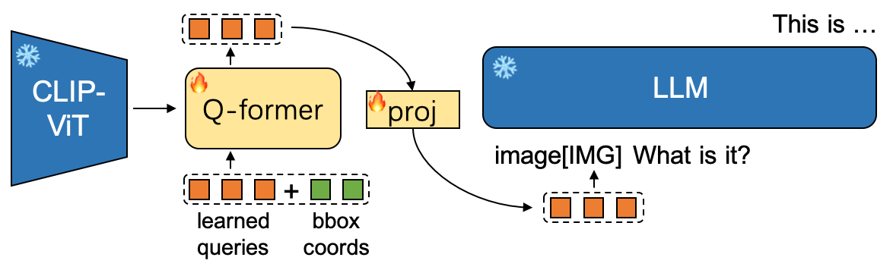
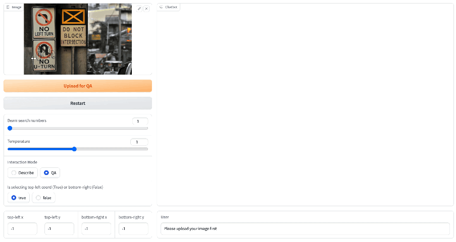

# Click4Caption


## Introduction
Click4Caption is modified from [MiniGPT-4](https://github.com/Vision-CAIR/MiniGPT-4) which further supports bounding box coords input to Q-Former. Q-Former extracts the bbox-relevant image embs which will be delivered to LLM for description or QA.

The main modifications lie in:
* Q-Former accepts bbox input and accordingly we train both the Q-former and the proj layer.
* We use the ensemble of multi-layer CLIP-ViT(fixed) features as image embs to retain the region details.
* Similar to [SAM](https://github.com/facebookresearch/segment-anything), we add posit embs again on the ViT image embs before feeding them for cross-attention in Q-former.


<!--  -->
<p align="center">
  
</p>


## Examples

**Check out the images in [assets/screenshot/](assets/screenshot/) dir for the specific answers in following gif.**

### Describe Mode:

Click the bbox(top-left and bottom-right corners) and the region description will be displayed automatically (with pre-set question).


<!-- |   |   |
:-------------------------:|:-------------------------:
 |   -->

<p align="center">
  
</p>

You can compare above results with [Caption-Anything](https://github.com/ttengwang/Caption-Anything)'s.

<p align="center">
  
</p>

You can compare above results with [GRiT](https://github.com/JialianW/GRiT)'s.


### QA Mode:

Upload regions(or whole images) for QA.

<!-- |   |   |
:-------------------------:|:-------------------------:
 |   -->

<p align="center">
  
</p>

<p align="center">
  
</p>


## Getting Started

### Evaluation

**1. Prepare the code and the environment**


```bash
git clone https://github.com/ssppp/Click4Caption.git
cd Click4Caption
pip install -r requirements.txt
```


**2. Prepare the pretrained weights**

Download the pretrained weights and put it into the `./cached_model` directory.

* our model ckpt (Qformer & proj): [ckpt-for-vicuna-13b-v0](https://drive.google.com/file/d/1GXqxKx6QeHtSSlMMzD8w62w9bJcFF82V/view?usp=sharing), ckpt-for-vicuna-7b-v0 is to be released.

* eva_vit_g: download from [here](https://storage.googleapis.com/sfr-vision-language-research/LAVIS/models/BLIP2/eva_vit_g.pth).

* vicuna-13b-v0: please refer [here](https://github.com/Vision-CAIR/MiniGPT-4/blob/main/PrepareVicuna.md) for preparation, or setting a soft link as below if you already have one
```bash
cd cached_model
ln -s /path/to/vicuna-13b-v0 vicuna-13b-v0
```

* bert-base-uncased: download from huggingface [here](https://huggingface.co/bert-base-uncased/tree/main) or setting a soft link if you already have one
```bash
cd cached_model
ln -s /path/to/bert-base-uncased bert-base-uncased
```


**3. Launching Demo or Run Inference**

Try out our demo [demo.py](demo.py) on your local machine by running

```
python demo.py --cfg-path eval_configs/click4caption_eval.yaml  --gpu-id 0
```


To save GPU memory, you can set the low_resource flag as True in the config file 
[eval_configs/click4caption_eval.yaml](eval_configs/click4caption_eval.yaml). It will load LLM in 8bit and run ViT in CPU.

NOTE: 
In the "Describe" interaction mode, you can
* choose an image (no need to click the upload button)
* click the top-left coord in the image
* click the bottom-right coord in the image

and then you can see an image with the clicked bbox drawn on it and the description for the region in the chatbot block.

In the "QA" interaction mode, you can
* choose an image, click the top-left and bottom-right coords respectively, and then click the upload button
* (optional) upload more images(regions)
* ask question about the image(s), you should use '[IMG]' as image placeholder which will be substituted with the real image embs before feeding to LLM. **We recommend to use the format like: 'image[IMG] Write a poem for this person.' for single image input or 'image 1[IMG] image 2[IMG] Write a story that combines image 1 and image 2.' for multiple images input**.

and then you can see the LLM reply in the chatbot block.


Besides the gradio demo, you can run [inference.py](inference.py) for simple eval with image_path, bbox and question as args input
```python
python inference.py --cfg-path eval_configs/click4caption_eval.yaml --gpu-id 0 --image_path /path/to/image --tl_x -1 --tl_y -1 --br_x -1 --br_y -1 --input_text 'image[IMG] What is it?'
```
Please refer to [inference.py](inference.py) for the specific args setting.


***
### Training

To be released.


## Acknowledgement

Thanks for the excellent work and codes of [MiniGPT-4](https://github.com/Vision-CAIR/MiniGPT-4), [BLIP2](https://github.com/salesforce/LAVIS/tree/main/projects/blip2), [Vicuna](https://github.com/lm-sys/FastChat), [SAM](https://github.com/facebookresearch/segment-anything), [Caption-Anything](https://github.com/ttengwang/Caption-Anything) and [GRiT](https://github.com/JialianW/GRiT).


## License
This repository is under [BSD 3-Clause License](LICENSE.md).
